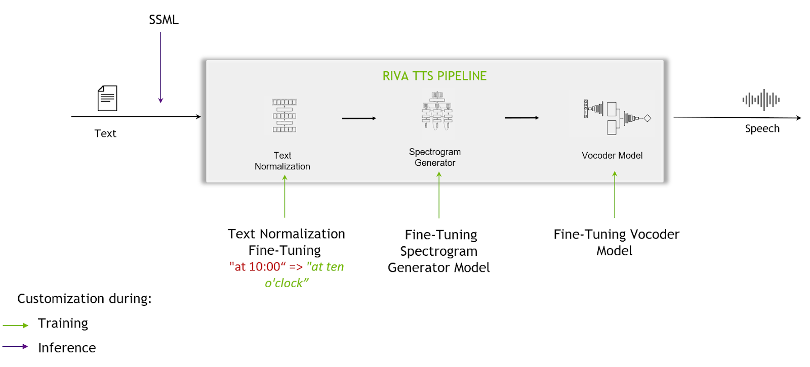

# How to customize the output of RIVA Text-to-speech

In this tutorial, let's explore the customization techniques that can improve the quality of the voice synthesized by Riva, such as:

- Controlling the pitch, rate and pronunciation.
- Adding a speaker's accent: British English, American English
- Speaker's voice: your own voice, different language

Various customization techniques can assist when out-of-the-box Riva models fall short of dealing with challenging scenarios not likely seen in their training data.

## Overview of Riva TTS customization techniques

The text-to-speech service in Riva is based on a two-stage pipeline. Riva first generates mel spectrograms for the input text using a spectrogram generator neural network, and then uses these spectrograms to generate speech using the vocoder model. 

[FastPitch](https://arxiv.org/pdf/2006.06873.pdf) is a mel-spectrogram generator, designed to be used as the first part of a neural text-to-speech system in conjunction with a neural vocoder. FastPitch is a fully-parallel text-to-speech model based on FastSpeech, conditioned on fundamental frequency contours. The model predicts pitch contours during inference. By altering these predictions, the generated speech can be more expressive, better match the semantic of the utterance, and in the end more engaging to the listener. FastPitch is based on a fully-parallel Transformer architecture, with much higher real-time factor than Tacotron2 for mel-spectrogram synthesis of a typical utterance.

[HifiGAN](https://arxiv.org/pdf/2010.05646.pdf) is a neural vocoder model for text-to-speech applications. It is intended as the second part of a two-stage speech synthesis pipeline, with a mel-spectrogram generator such as FastPitch as the first stage. HifiGAN is a neural vocoder based on a generative adversarial network framework. During training, the model uses a powerful discriminator consisting of small sub-discriminators, each one focusing on specific periodic parts of a raw waveform. The generator is very fast and has a small footprint, while producing high quality speech. 

This pipeline forms a text-to-speech system that enables us to synthesize natural sounding speech from raw transcripts without any additional information such as patterns or rhythms of speech.

The below flow diagram shows the Riva speech synthesis pipeline along with the possible customizations.

The following customizations can help to control and improve the synthesized speech. These customizations are listed in increasing order of difficulty and efforts.:

| Techniques                        | Difficulty      | What it does                                              | When to use                                                                    | How to use                                                                                                                                                                                 |
|-----------------------------------|-----------------|-----------------------------------------------------------|--------------------------------------------------------------------------------|--------------------------------------------------------------------------------------------------------------------------------------------------------------------------------------------|
| 1. SSML tags                    | Quick and easy  | Changes the pitch, rate, and pronunciation through phoneme.           | When you want to emphasize or want particular pronounciation for certain words | [Customization with SSML]( https://github.com/nvidia-riva/tutorials/blob/dev/22.05/tts-python-advanced-customization-with-ssml.ipynb)                           |
| 2. Training FastPitch and HiFiGAN  | Moderately hard | Train the FastPitch and HifiGAN models on custom data | When you want to change the accent, language or voice of the speaker           | [FastPitch/HiFiGAN training](https://github.com/nvidia-riva/tutorials/blob/dev/22.05/tts-python-advanced-pretrain-tts-tao-training.ipynb), [FastPitch/HiFiGAN deployment](https://github.com/nvidia-riva/tutorials/blob/dev/22.05/tts-python-advanced-pretrain-tts-tao-deployment.ipynb), with TAO Toolkit |
|                                   |                 |                                                           |                                                                                |                                                                                                                                                                                            |

In the next section, we will give a more detailed discussions of each technique. For a how-to step-by-step guide, consult the notebooks linked in the table.

## 1. SSML tags
Speech Synthesis Markup Language (SSML) specification is a markup for directing the performance of the virtual speaker. Riva supports portions of SSML, allowing you to adjust pitch, rate, and pronunciation of the generated audio.

Riva TTS supports two SSML tags:

- The `prosody` tag, which supports two attributes `rate` and `pitch`, through which we can control the rate and pitch of the generated audio.
    1. Pitch attribute - 
    Riva supports an additive relative change to the pitch. The pitch attribute has a range of [-3, 3]. This value returns a pitch shift of the attribute value multiplied with the speaker’s pitch standard deviation when the FastPitch model is trained. 

    2. Rate attribute -
    Riva supports a percentage relative change to the rate. The rate attribute has a range of [25%, 250%].

- The `phoneme` tag, which allows us to control the pronunciation of the generated audio.
    1. Phoneme tag -
    For a given word or sequence of words, use the ph attribute to provide an explicit pronunciation, and the alphabet attribute to provide the phone set. Currently, only x-arpabet is supported for pronunciation dictionaries based on CMUdict.

## 2. Training FastPitch and HiFiGAN

End-to-end training of TTS models requires large datasets and heavy compute resources. 

For this reason, we only recommend training models from scratch where several hundreds of hours of transcribed speech data is available.

While you collect the text dataset for TTS, you need to remember that TTS models learn to map n-grams to sounds. Thus, you should ensure that the text data isn't archaic and it should have sufficient phoneme coverage.

**Note:** Finetuning TTS models is a [recent advancement](https://paarthneekhara.github.io/tlfortts/) in the field of audio synthesis and is usually used to adapt the pre-trained TTS models for a different accent.
NVIDIA offers pre-trained [FastPitch](https://catalog.ngc.nvidia.com/orgs/nvidia/teams/tao/models/speechsynthesis_hifigan) and [HiFiGAN](https://catalog.ngc.nvidia.com/orgs/nvidia/teams/tao/models/speechsynthesis_hifigan) models, trained on 25+ hours of LJSpeech dataset, which can be used for finetuning. Though finetuning is out of scope for this lab, we would be covering it in the next release. Stay tuned!

# Conclusion

Riva offers a rich set of customization techniques that you can use to help improve out-of-the-box performance and adapt the synthesized speech according to your needs.

